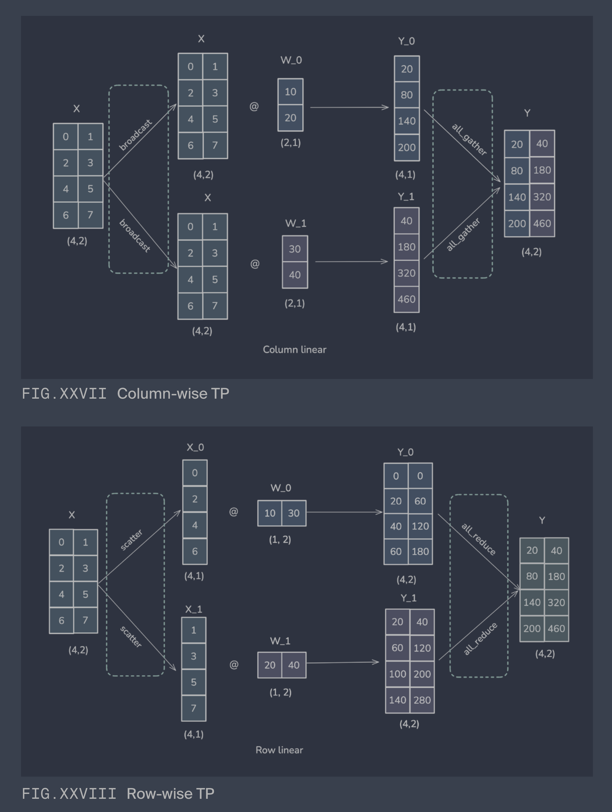

# 1. Tensor Parallelism (TP)

## 1.1. Refer

[Megatron-LM paper](https://arxiv.org/abs/1909.08053)

## 1.2. Demonstration

`tp_demo.py`

```py
# Normal way
[1 2] @ [1 2 1 2  @ [2 2  = [3 6 5 6] @ [2 2 = [6+12+10+6 6+12+5+6] = [34 29]
         1 2 2 2]    2 2                 2 2
                     2 1                 2 1
                     1 1]                1 1]

# Normal split way

Step 1 split N on second matrix:

[1 2] @ [1 2 1 2  = [1 2] @ [1 2  concatenate [1 2] @ [1 2
         1 2 2 2]            1 2]                      2 2]
                  = [3 6] concatenate [5 6] = [3 6 5 6]

Step 2 split K on step 1 result and third matrix:
[3 6 5 6] @ [2 2 = [3 6] @ [2 2  element-wise add [5 6] @ [2 1
             2 2            2 2]                           1 1]
             2 1
             1 1]
                 = [6+12 6+12] element-wise add [10+6 5+6]
                 = [18 18] element-wise add [16 11]
                 = [34 29]

# Tensor Parallelism way

Step 1 split N on second Matrix

[1 2] @ [1 2 1 2  = [[1 2] @ [1 2   [1 2] @ [1 2
         1 2 2 2]            1 2]           2 2]]
                  = [[3 6] [5 6]]

Step 2 split K on third matrix

[3 6] @ [2 2  element-wise add [5 6] @ [2 1
         2 2]                           1 1]
= [34 29]
```

- TP save one concatenate(gather) compare to the normal split way

## 1.3. 2M,2K,2N Split cases

2 matrix multiply, (2M,2K) @ (2K,2N)

| 拆分维度  | 单 GPU 结果                        | 合并方式          | 所需通信                      | usage          |
| --------- | ---------------------------------- | ----------------- | ----------------------------- | -------------- |
| M         | M1(M,2N),M2(M,2N)                  | [M1,M2]           | `gather` concat               | Column-wise TP |
| K         | M1(2M,2N),M2(2M,2N)                | M1+M2             | `all-reduce` element-wise add | Row-wise TP    |
| N         | $ C_i = A B_i $                    | `concat` 列       | `gather`                      |                |
| M & K     | $ C_i = A_i B_i $                  | 分块乘法          | `all-reduce` + `broadcast`    |                |
| M & N     | $ C*{ij} = \sum_k A*{ik} B\_{kj} $ | 分块乘法          | `all-reduce`                  |                |
| K & N     | $ C_i = A_i B_i $                  | 分块乘法          | `all-reduce`                  |                |
| M & N & K | $ C*{ij} = \sum_k A*{ik} B\_{kj} $ | 分块乘法 + reduce | `all-reduce` + `broadcast`    |                |

{width=400px}

# 2. Tensor Parallelism (TP) Implementation Notes

This document captures the implementation details of the Tensor Parallelism found in the `nanovllm` codebase.

## 2.1. Orchestration via `model_runner.call()`

A key architectural choice is the use of `self.model_runner.call("run", ...)` instead of a direct call like `self.model_runner.run(...)`.

This is designed to enable **Tensor Parallelism** across multiple GPUs. The `call()` method acts as a **Remote Procedure Call (RPC)** mechanism to ensure the same command is executed synchronously across all processes in the tensor parallel group.

### 2.1.1. The Problem with Direct Calls

In a tensor-parallel model, a direct call (`model_runner.run(...)`) would only be executed by the main process (`rank=0`). The worker processes (`rank > 0`) would remain idle. When the main process reaches a distributed communication point (e.g., `all_reduce`), it would wait forever for the workers that never started the task, causing the program to hang.

### 2.1.2. The `call()` Solution

The `call()` method orchestrates the execution across all processes:

1. **Worker Processes Wait:** All worker processes (`rank > 0`) start in an infinite `loop()` where they wait for a command from a shared memory block.

2. **Main Process Issues Command:** The main process (`rank=0`), upon entering `call()`, does two things:

   - **Broadcasts:** It serializes the method name and arguments and writes them to a `multiprocessing.SharedMemory` block, notifying the workers.
   - **Executes:** It then proceeds to execute the target method locally.

3. **Workers Execute Command:** The workers are awakened by the notification, read the command from shared memory, and then execute the same target method locally.

This ensures all processes execute the `run` method in sync, allowing tensor parallelism to work correctly.

## 2.2. How `multiprocessing.SharedMemory` is Implemented

`SharedMemory` is a Python wrapper around powerful OS primitives. On Linux, this is how it works:

1. **Creation (`shm_open`)**: A process creates a named shared memory object. On Linux, this creates a special file-like object in a RAM-backed filesystem, usually `/dev/shm/`.
2. **Sizing (`ftruncate`)**: The creator sets the size of the memory segment.
3. **Mapping (`mmap`)**: The process "memory-maps" the object into its own virtual address space. `mmap` returns a pointer to this memory, which Python wraps in the `.buf` object.
4. **Attachment**: Other processes use the same name to open the object and `mmap` it into their own address spaces. While the virtual addresses may differ between processes, they all point to the **same underlying block of physical RAM**.
5. **Cleanup**:
   - `.close()` calls `munmap()`, detaching the memory from the current process.
   - `.unlink()` calls `shm_unlink()`, marking the object for deletion by the OS once all processes have detached from it. This prevents memory leaks.

## 2.3. Data Race Avoidance in Shared Memory

`multiprocessing.SharedMemory` on its own **does not** prevent data races. It is a raw block of memory, and the programmer is responsible for using **synchronization primitives** to orchestrate access.

The `nanovllm` code uses a `multiprocessing.Event` to implement a producer-consumer pattern:

1. **Consumers Wait**: Worker processes (`rank > 0`) call `event.wait()` and go to sleep, waiting for a signal.
2. **Producer Writes & Signals**: The main process (`rank=0`) writes data to the shared memory, and only when it's finished, it calls `event.set()`.
3. **Consumers Wake & Read**: The `set()` call wakes the workers, which now know it is safe to read the data. They then call `event.clear()` to reset for the next cycle.

This ensures that reading and writing operations are never performed simultaneously.

## 2.4. Deep Dive: `multiprocessing.Event` Implementation

An `Event` is a Python wrapper around efficient OS-level synchronization primitives. Its primary goal is to allow a process to `wait()` without burning CPU in a "busy-loop" (i.e., `while True: pass`).

The implementation on Linux is generally built from two components, both residing in shared memory:

1. **A shared flag:** A simple boolean value that represents the internal state of the event (set or cleared).
2. **A kernel-level semaphore or futex:** This is the crucial piece that allows for efficient, non-busy waiting.

Here’s a simplified breakdown of how the methods work, using a **semaphore** as the underlying primitive.

### 2.4.1. The Components in Shared Memory

Imagine a small block of shared memory is allocated for the Event. It contains:

- `is_set_flag`: A boolean, initially `False`.
- `semaphore`: An OS semaphore, initialized with a value of 0. A semaphore with a value of 0 will cause any process that tries to "wait" on it to go to sleep.

### 2.4.2. How the Methods are Implemented

#### 2.4.2.1. `Event.clear()`

1. It acquires a lock (to prevent race conditions with `set()` or `wait()`).
2. It sets the `is_set_flag` in shared memory to `False`.
3. It releases the lock.

#### 2.4.2.2. `Event.set()`

1. It acquires the lock.
2. It sets the `is_set_flag` in shared memory to `True`.
3. It calls `sem_post()` on the OS semaphore. This is the "wake-up" call that increments the semaphore's value and tells the OS to wake up any processes that are currently sleeping on this semaphore.
4. It releases the lock.

#### 2.4.2.3. `Event.wait()`

1. It acquires a lock.
2. It first checks the `is_set_flag`.
   - **If `True`:** The event is already set. It releases the lock and returns immediately.
   - **If `False`:** The process needs to go to sleep.
3. It releases the lock.
4. It calls `sem_wait()` on the OS semaphore. The OS takes over, puts the process to sleep (consuming no CPU), and will only wake it when another process calls `set()`.

### 2.4.3. Why This is Efficient: The "Busy-Wait" Problem

If you only had a shared boolean flag, your `wait()` would have to be a "busy-wait":

```python
# THIS IS BAD AND INEFFICIENT!
def busy_wait(self):
    while not self.is_set_flag_in_shared_memory:
        pass # Spin at 100% CPU
```

By using an OS primitive like a semaphore, the `wait()` call allows the process to yield control to the OS scheduler, ensuring CPU cycles are not wasted. This is the foundation of efficient multitasking.
